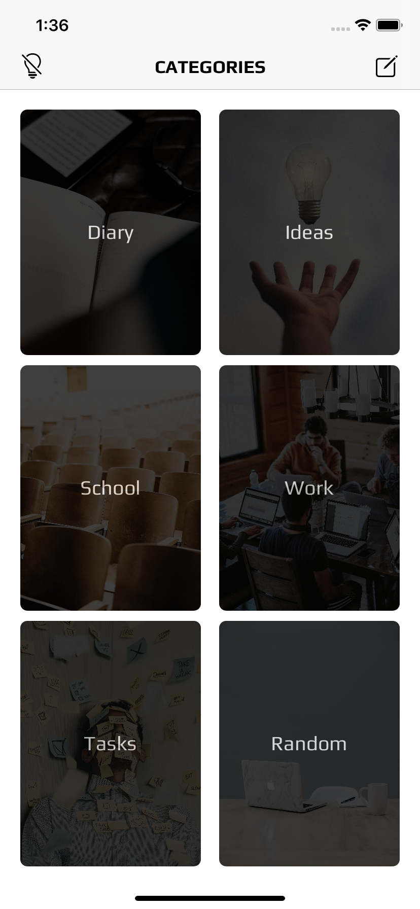

# Transcript

Fun app that turns a live audio recording, into a text transcription.

### Technologies:

* UIKit
* Core Data
* Speech
* PDFKit

### Features:
* Record audio for up to a minute, that converts to text.
* Edit text after recording has completed.
* Organise transcripts into relevant categories.
* Share transcripts as a PDF document.
* Supports iOS13 light and dark modes.

### Screenshots:

 
 
 
 
